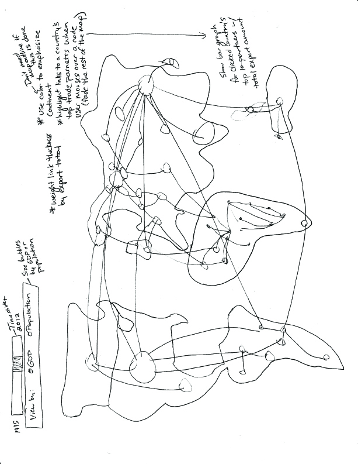
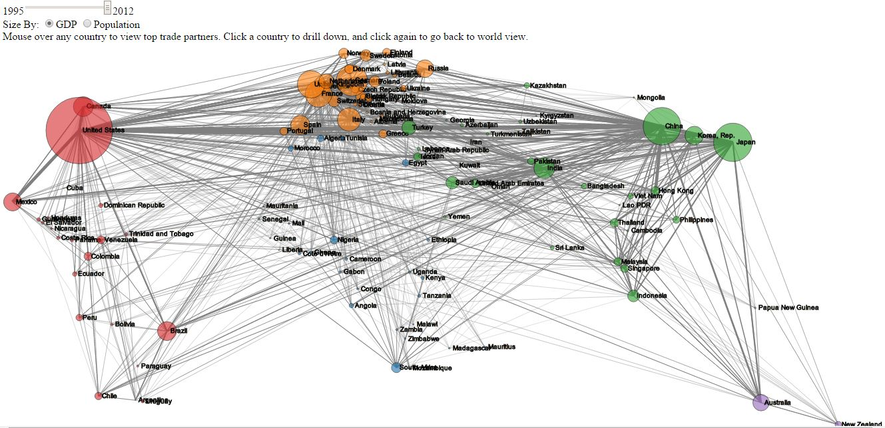
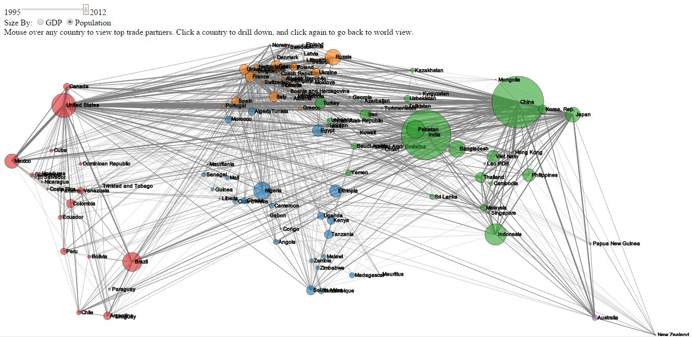
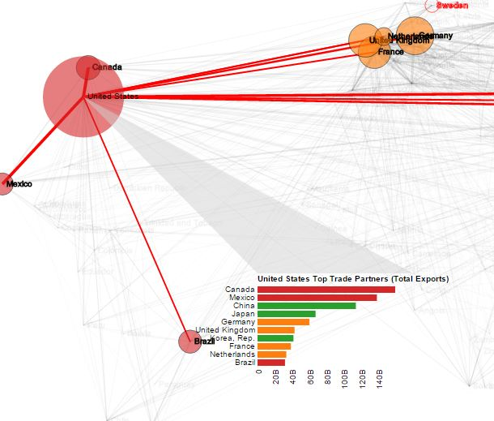
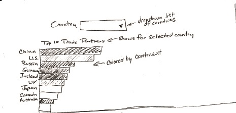
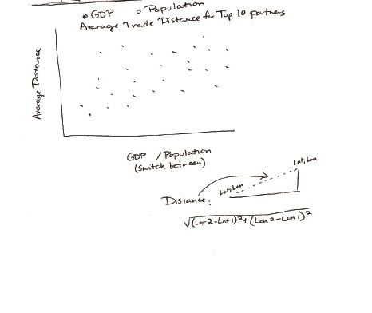
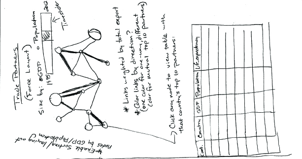

Design
======

I thought there was a lot of value in showing the data by geographic position since location is significant to trade, so the design I chose mapped countries in a scatterplot by latitude and longitude. 

  

I used several different channels to encode data:

* Node size: GDP or Population as selected by user (based on a square root scale)

* Link width: Total Export value (based on square root scale)

* Color: Continent (for visual grouping)

  

I also included a time slider to enable the user to view changes in trade patterns over time. 

The user can toggle between encoding the bubble size with GDP or Population

  

Since the whole map view is kind of cluttered with so many links I designed a mouseover function that dims all nodes and links that are not associated with the top 10 trade partners of the country the user is mousing over.

  

I realized during implementation that it would be useful to be able to view a particular country's trade network over different years but there was no way to change the time slider while mousing over a country so I created a function that enables the user to click on a country to persist the view. The user is then able to change the year while still viewing only one country's partners, and can then go back to the world view by clicking the country a second time.

I also decided to incorporate one of my alternate designs, a bar chart showing total export values for the country's top 10 trade partners in order to provide more detail on these values and show rankings since it link width was only effective in conveying a very general overview of total export.

  

Alternate Designs
=================

The first design takes a country as input and shows a barchart ordering the country's top 10 trade partners by total export value. I ended up using this in my final design as a drill-down component from the map.

  

The following design was intended to answer questions about trade distance, and determine whether countries with larger populations or GDP values were more likely to trade with farther away countries. The design was a simple scatter plot and the user would be able to switch between GDP and Population for the x-axis value, and show average trade distance for the top 10 partners on the y-axis. A time slider would also enable viewing changes over time.

  

The following design was centered on a force layout, with nodes sized by GDP or Population (determined by the user), links weighted by total export, and nodes colored by continent. There is also a capability to drill down to view details about each set of trade partners in a table view when the user clicks on a node. 

  

