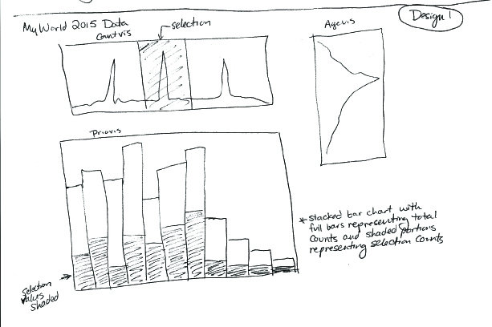
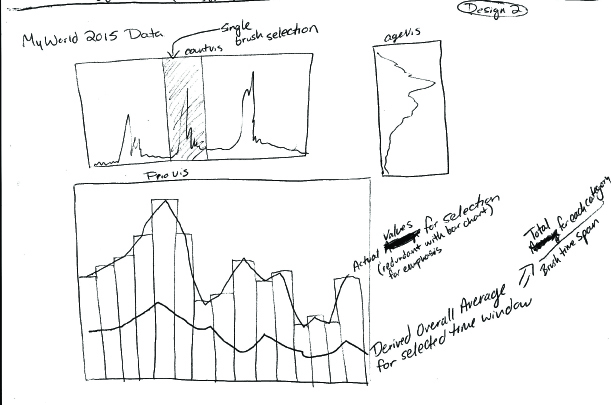
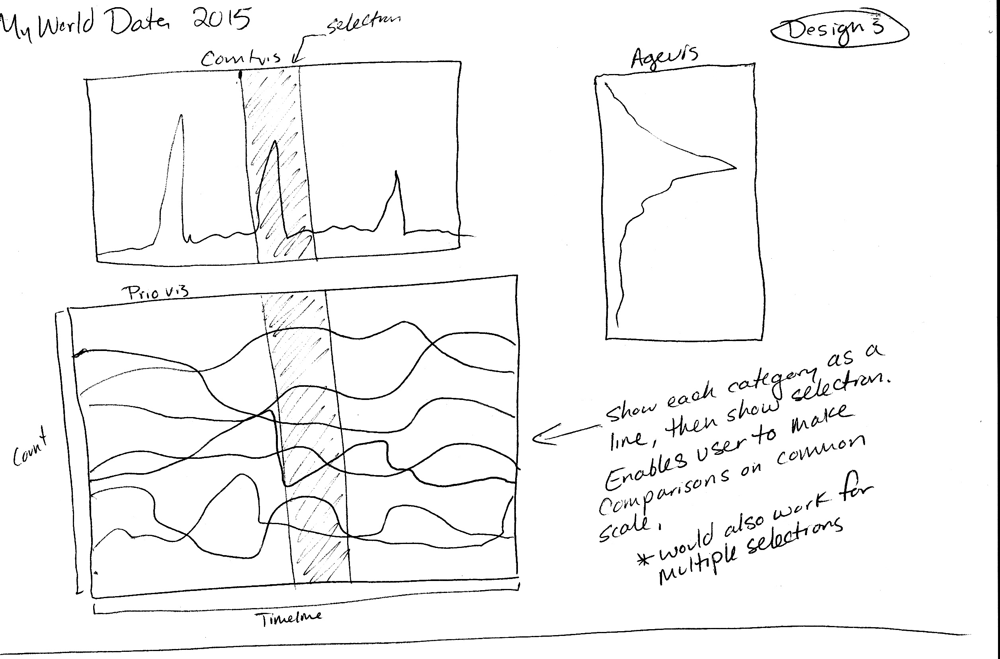
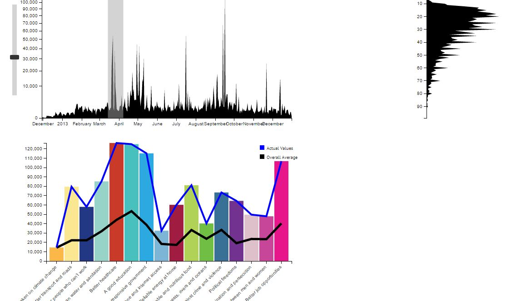
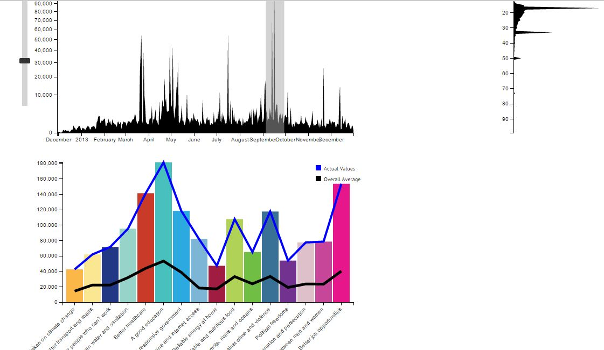

# Answers for Questions

### Q5a
**Question:** Choose __one__ comparison scenario and create at least three alternative designs that would allow this comparison.

-
**Answer:**

- put your sketches in folder [designStudio/](designStudio/)

- I tried a few different designs for priovis for the scenario of comparing the selecton to the overall average. I chose this scenario because I thought it was more informative to have a standard of comparison (overall average) rather than compare two arbitrary selections.

Design 1:

  

Design 2:

  

Design 3:

  

### Q5b
**Question:** Implement one design in your visualization for **PrioVis** and explain why you have chosen this design.

-
**Answer:**

- I chose Design 2 as the design for my implementation of priovis. In this scenario I saw credence to Tufte's minimalistic approach to convey information in the simplest but most effective way possible. I thought Design 2 did this well, as the bars show the relative ratios of numbers of votes in each category of the selection, while the black line shows the number of votes for a time period equal to the selection time period derived from the overall averages for each category. Since it was difficult to visually compare patterns between the line and bars I added a blue line on top of the bars to represent the data from the selection. This made it easy to compare trends visually by looking at differences in shape between the two lines, yet still easy to see relative ratios between the bars (which is difficult with just a line).

### Q5c
**Question:** As a very minimal case study submit a screenshot of an interesting pattern which you have found with your method and briefly describe the pattern.

-
**Answer:**

- Using my visualization for the chosen design I discovered two interesting patterns in the data:

First, while the shape of the line remained relatively consistent across the year (indicating that the relative proportions of votes across the categories remained similar), when I placed the selection over the spike in March 2014 the proportions changed dramatically with Better Healthcare making up a much higher proportion that normal. This is likely due to the fact that the deadline for signing up for the first round of the Affordable Healthcare Act was at the end of March 2014. There was also a small spike in the better transport and roads category which makes sense as most potholes show up in roads in March after the temperatures rise from the winter.

  

Next, in September the number of votes for Better Education far exceeded the baseline in comparison to the other categories. Looking at agevis the voting population was also on the younger side. Both of these things make sense since schools typically start around September, and the 18-22 college age group is likely to be thinking about education.

  

